# Sistema de Elecciones

_Este proyecto es un sistema de gestión de elecciones desarrollado para un solo partido político. Permite a los usuarios realizar sugerencias, votar por un candidato y ver los resultados, además de proporcionar herramientas administrativas para gestionar sugerencias y resultados._

## Funcionalidades

### Para los usuarios
- Ver la lista de candidatos junto con su información personal y académica.
- Conocer las propuestas planteadas por la lista de candidatos.
- Acceder a eventos y noticias relacionadas con el proceso electoral.
- Votar por un candidato de su elección.
- Enviar sugerencias sobre el proceso electoral.

### Para los administradores
- Crear y gestionar candidatos.
- Publicar y administrar propuestas electorales.
- Gestionar eventos y noticias.
- Administrar las sugerencias enviadas por los usuarios.
- Supervisar los resultados de las elecciones en tiempo real.

## Tabla de Contenidos 📑
1. [Comenzando 🚀](#comenzando-)
2. [Pre-requisitos 📋](#pre-requisitos-)
3. [Construido con 🛠️](#construido-con-)
4. [Instalación 🔧](#instalación-)
5. [Funcionamiento de la pagina ⚙️](#funcionamiento)
6. [Despliegue 📦](#despliegue-)
7. [Autores ✒️](#autores-)
8. [Expresiones de Gratitud 🎁](#expresiones-de-gratitud-)


## Comenzando 🚀

_Estas instrucciones te permitirán obtener una copia del proyecto en funcionamiento en tu máquina local para propósitos de desarrollo y pruebas._

Mira **Despliegue** para conocer cómo desplegar el proyecto.

### Pre-requisitos 📋

_Que cosas necesitas para instalar el software y cómo instalarlas_

- Un servidor web compatible con PHP (por ejemplo, [XAMPP](https://www.apachefriends.org/), [WAMP](https://www.wampserver.com/), o similar).
- MySQL o cualquier base de datos compatible.
- Navegador web para pruebas.
- Editor de texto o IDE (por ejemplo, Visual Studio Code).

### Construido con 🛠️

_Herramientas utilizadas para desarrollar el proyecto:_

* [PHP](https://www.php.net/) - Lenguaje de programación principal.
* [MySQL](https://www.mysql.com/) - Base de datos.
* [Apache](https://httpd.apache.org/) - Servidor web.
* [Bootstrap](https://getbootstrap.com/) - Framework CSS para el diseño.

### Instalación 🔧

_Sigue estos pasos para tener el proyecto funcionando en tu entorno local:_

1. **Clona el repositorio** en tu máquina local: git clone https://github.com/Diego200509/Pagina_Web.git


2. **Configura la base de datos**:
- Ajusta las credenciales de conexión en los archivos PHP donde sea necesario, como `config.php`:
  ```php
  $servername = "localhost";
  $username = "root";
  $password = "tu_contraseña";
  $dbname = "elecciones2024";
  ```

3. **Configura el entorno de desarrollo**:
- Asegúrate de que tu servidor web esté apuntando a la carpeta del proyecto.
- Verifica que PHP y MySQL estén activos.

4. **Ejecuta el proyecto**:
- Abre tu navegador y accede a `http://localhost/Pagina_Web/Pagina_Web/Home/inicio.php` para acceder como usuario.
- Abre tu navegador y accede a `http://localhost/Pagina_Web/Pagina_Web/Login/Login.php` para acceder como administrador. 

5. **Realiza pruebas iniciales**:
- Accede como usuario y administrador para validar el funcionamiento.

- Crear una sugerencia como usuario.
- Revisar y aprobar la sugerencia como administrador.
- Verificar que la sugerencia se muestre en la sección correspondiente.


### Funcionamiento de la pagina ⚙️
### **Inicio - Vista del Usuario**
Al ingresar a la página web, los usuarios son recibidos con una interfaz visual atractiva y organizada. En la imagen proporcionada, se observa la página principal de la plataforma de elecciones, con las siguientes características:

1. **Encabezado y Menú de Navegación**  
   - En la parte superior, se encuentra una barra azul con el logotipo de la lista "MARY CRUZ".
   - También se muestran iconos y enlaces de acceso rápido a las principales secciones del sistema, incluyendo:  
     - **Candidatos:** Información detallada sobre cada candidato, incluyendo su perfil académico y personal.  
     - **Eventos y Noticias:** Publicaciones sobre actividades y novedades relacionadas con la elección.  
     - **Propuestas:** Iniciativas presentadas por la lista electoral para mejorar la institución universitaria.  
     - **Sugerencias:** Sección donde los usuarios pueden enviar sus sugerencias.  
     - **Votos:** Espacio donde los usuarios pueden emitir su voto de manera digital por su candidato favorito.
2. **Sección de Presentación de la Lista Electoral**  
   - Justo debajo del encabezado, se muestra una imagen destacada con los principales miembros de la lista electoral.  
   - En los laterales de la imagen hay flechas de navegación, lo que indica que es un carrusel que puede mostrar más imágenes con información relevante.

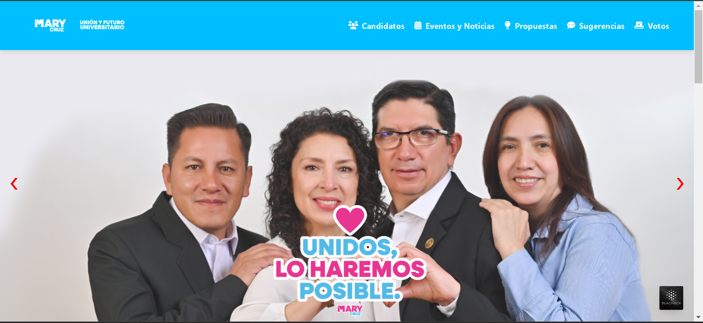

### **Vista Previa de los Candidatos**
En la sección "Conoce a nuestros Candidatos", los usuarios pueden ver una vista previa de los candidatos que forman parte de la lista electoral. Esta sección destaca lo siguiente:

1. **Presentación Visual de los Candidatos**  
   - Se muestran tarjetas con la fotografía de cada candidato, su nombre y el cargo al que aspiran.  

2. **Información Relevante**  
   - Cada candidato tiene su propio recuadro, donde se especifica su rol dentro de la estructura electoral.  
   - Esta información permite a los usuarios conocer de manera rápida a los postulantes y su perfil.

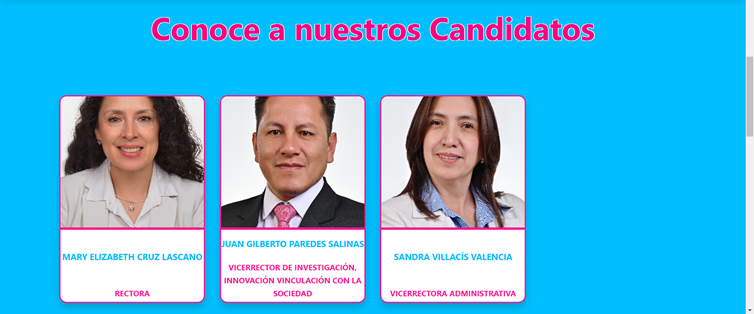

### **Vista Previa de las Propuestas**
En la sección "Propuestas", los usuarios pueden conocer las iniciativas que plantea la lista electoral para la universidad. Esta sección se estructura de la siguiente manera:

1. **Tarjetas con Propuestas Destacadas**  
   - Se presentan tarjetas con el título, descripción y categoría de cada propuesta.
   - Las categorías pueden estar orientadas a distintos ámbitos como "Investigación" o "Vinculación con la Sociedad", etc.

2. **Detalles de cada Propuesta**  
   - Cada tarjeta contiene un breve resumen que explica el objetivo de la propuesta.

3. **Acceso a más Información**  
   - Si el usuario desea conocer más detalles sobre cada propuesta, puede presionar en "ver mas" para que le aparezca la información completa.

   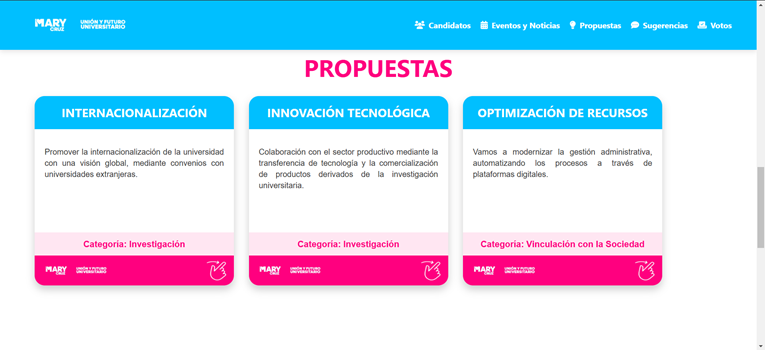
   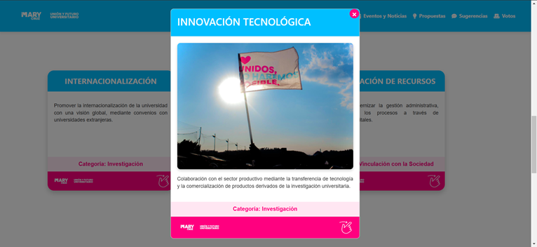

### **Vista Previa de Eventos y Noticias**
Dentro de la página de inicio, los usuarios pueden interactuar con la sección "Eventos y Noticias" para visualizar información relevante de manera dinámica.

1. **Interacción con Botones**  
   - La sección cuenta con dos botones principales: "Mostrar Eventos" y "Mostrar Noticias".  
   - Al hacer clic en "Mostrar Eventos", se despliega una lista con los eventos más recientes relacionados con la campaña.  
   - Al hacer clic en "Mostrar Noticias", se muestran las noticias más recientes sobre el proceso electoral.

2. **Visualización de Eventos y Noticias Recientes**  
   - Se presentan tarjetas con información detallada de los cuatro eventos y noticias más recientes.
   - Cada tarjeta incluye:
     - Título del evento o noticia.
     - Breve descripción.
     - Fecha y ubicación (en caso de eventos).

3. **Diseño Interactivo**  
   - La interfaz permite a los usuarios alternar entre eventos y noticias fácilmente, mejorando la experiencia de navegación.

   

   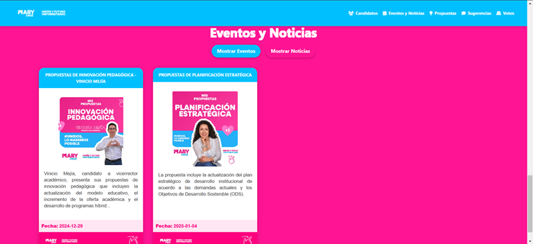

### **Sección de Candidatos - Vista del Usuario**
En la sección "Candidatos", los usuarios pueden ver información detallada sobre cada postulante que forma parte de la lista electoral.

1. **Información Individual del Candidato**  
   - Se muestra una tarjeta con la información de cada candidato de manera organizada.
   - Incluye:
     - **Fotografía** del candidato.
     - **Nombre completo**, resaltado en negritas.
     - **Edad** del candidato.
     - **Cargo** al que aspira.
     - **Información académica y profesional**, como títulos y especialidades.
     - **Experiencia relevante**, en este caso, el cargo que ha ocupado anteriormente.

2. **Interfaz de Navegación**  
   - A los lados de la tarjeta hay flechas de navegación que permiten al usuario desplazarse entre diferentes candidatos.
   - Esto permite una visualización intuitiva y organizada de la información.

   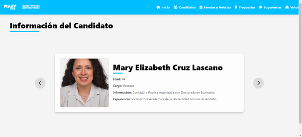

### **Sección de Eventos y Noticias - Vista del Usuario**
En la sección "Eventos y Noticias", los usuarios pueden mantenerse informados sobre las actividades más relevantes de la comunidad electoral.

#### **Eventos**
1. **Tarjetas Informativas**  
   - Se presentan tarjetas con detalles sobre los eventos organizados por la lista electoral.
   - Cada tarjeta incluye:
     - **Título del evento**.
     - **Imagen representativa** del evento.
     - **Breve descripción** del evento.
     - **Fecha y ubicación** del evento.
     - Un botón "Ver más" para acceder a la descripción completa.

2. **Objetivo de la Sección**  
   - Permite a los usuarios conocer los eventos más recientes y relevantes de la campaña electoral.
   - Facilita la organización de los asistentes y el seguimiento de actividades importantes.

   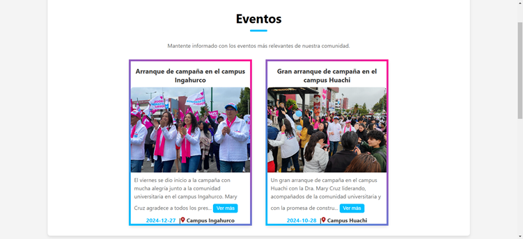

#### **Noticias**
1. **Tarjetas con Información Relevante**  
   - Se muestran noticias destacadas sobre la lista electoral y sus iniciativas.
   - Cada tarjeta contiene:
     - **Título de la noticia**.
     - **Imagen destacada**.
     - **Descripción breve**.
     - **Fecha de publicación**.
     - Un botón "Ver más" para acceder a la descripción completa.

   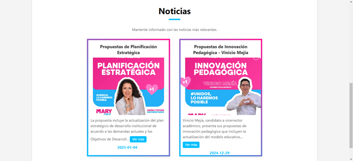

2. **Propósito de la Sección**  
   - Brinda a los usuarios acceso a las noticias más importantes sobre la lista electoral.
   - Mantiene informada a la comunidad sobre propuestas, avances y actividades de la campaña.

### **Sección de Propuestas - Vista del Usuario**
En la sección "Propuestas", los usuarios pueden conocer y explorar las iniciativas planteadas por la lista electoral.

1. **Interfaz de Filtrado**  
   - Se incluye un menú desplegable que permite a los usuarios filtrar las propuestas por facultad o interés.
   - Esto facilita la búsqueda de propuestas relevantes según las necesidades individuales.

2. **Tarjetas de Propuestas**  
   - Se presentan en un formato de tarjetas que muestran:
     - **Título de la propuesta**.
     - **Categoría** a la que pertenece (Investigación, Vinculación con la Sociedad, etc.).
     - **Breve descripción** del contenido y objetivo de la propuesta.
     - Un botón "Ver más" para acceder a la información completa de cada propuesta.
     
   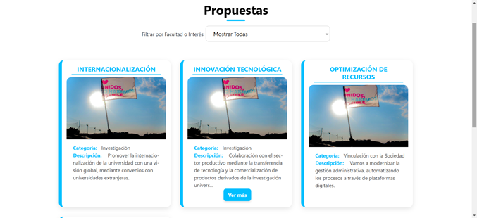

### **Sección de Sugerencias - Vista del Usuario**
En la sección "Sugerencias", los usuarios pueden enviar sus recomendaciones sobre la gestión de la lista electoral.

1. **Formulario de Sugerencias**  
   - Los usuarios pueden ingresar su nombre, correo electrónico (opcional) y su sugerencia en un campo de texto.
   - Se incluye un botón de "Enviar Sugerencia" para registrar la opinión.

2. **Confirmación de Envío**  
   - Una vez enviada la sugerencia, aparece una ventana emergente confirmando el envío exitoso.
   - Se muestra un mensaje de agradecimiento por la colaboración.
   
   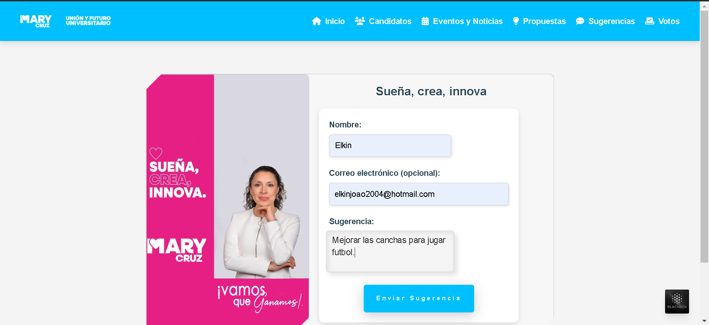

   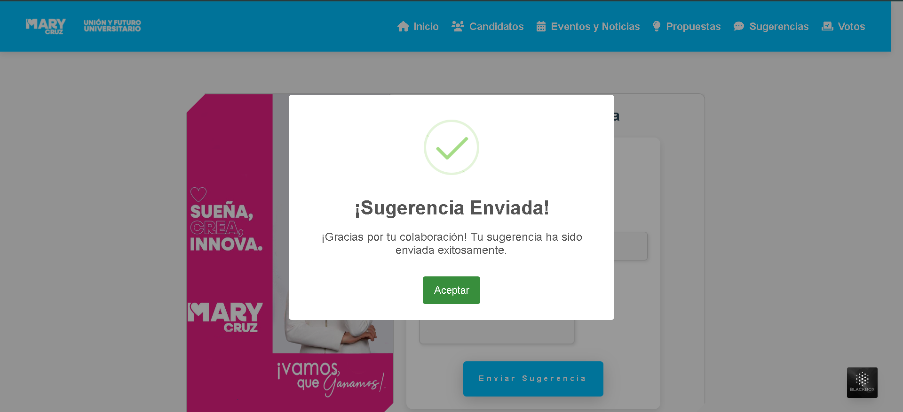

### **Sección de Votaciones - Vista del Usuario**
En la sección "Votos", los usuarios pueden participar activamente en la elección seleccionando a su candidato preferido.

1. **Interfaz de Selección de Candidato**  
   - Se presentan los candidatos disponibles con sus imágenes, nombres y lemas de campaña.
   - Los usuarios pueden marcar su candidato preferido seleccionando una opción de radio.
   - Se incluye un botón "Votar" para confirmar la elección.

2. **Proceso de Votación**  
   - Una vez que el usuario selecciona su candidato y presiona "Votar", el sistema registra el voto en la base de datos.

3. **Visualización de Resultados en Tiempo Real**  
   - Después de emitir el voto, los usuarios pueden ver los resultados actualizados de la elección.
   - Se presentan las estadísticas con el porcentaje de votos obtenidos por cada candidato.
   - Se muestra el número total de votos registrados hasta el momento.
   - Los resultados se actualizan dinámicamente conforme más usuarios emiten su voto.
   
   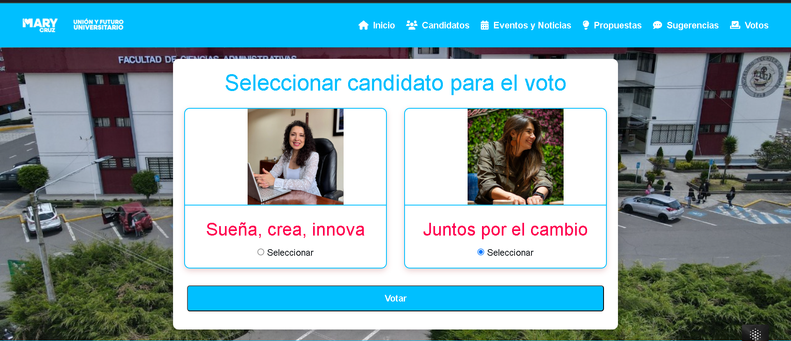

   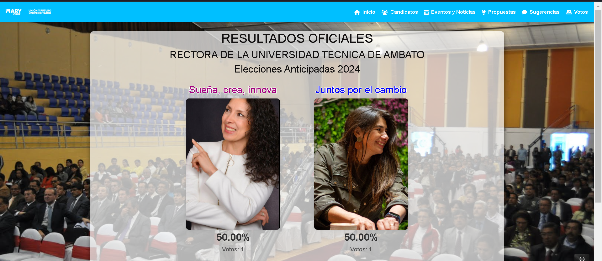

### **Login - Vista de Administración**
Para acceder a la vista de administración, el sistema cuenta con un proceso de autenticación.

1. **Acceso Restringido**  
   - Solo los administradores y el superadmin pueden acceder al panel de administración.
   - El sistema ya tiene un superadmin predefinido en la base de datos, quien es el primer usuario en iniciar sesión.

2. **Interfaz de Inicio de Sesión**  
   - Se muestra un formulario donde los administradores deben ingresar su correo electrónico y contraseña.
   - Un botón "Iniciar sesión" permite acceder al sistema tras la validación de credenciales.

3. **Validación de Credenciales**  
   - El sistema verifica las credenciales ingresadas con las almacenadas en la base de datos.
   - Si las credenciales son correctas, el usuario es redirigido al panel de administración.
   - En caso de error, se muestra un mensaje indicando que los datos son incorrectos.

   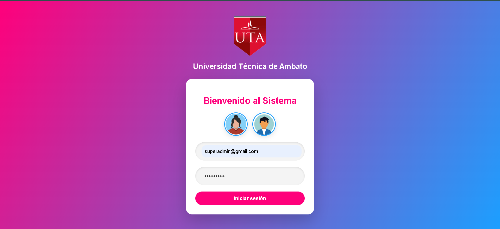

### **Sección de Administración - Vista del Administración**
La sección de administración está diseñada para que el superadmin tenga el control total sobre la gestión del sistema.

#### **Creación de Administradores**
1. **Acceso Exclusivo del Superadmin**  
   - Solo el superadmin tiene la capacidad de crear nuevos administradores dentro del sistema.
   - Los administradores creados pueden gestionar diversas funciones, pero no tienen acceso a la creación de otros administradores.

2. **Formulario de Creación de Administrador**  
   - Se requiere ingresar los siguientes datos:
     - **Nombre** del administrador.
     - **Correo electrónico** único para el acceso.
     - **Contraseña**, la cual debe tener un mínimo de 6 caracteres.
   - Se incluye un botón "Crear Admin" que registra el nuevo usuario en la base de datos.

3. **Validación de Datos**  
   - La contraseña ingresada debe cumplir con el requisito de al menos 6 caracteres para garantizar la seguridad.
   - Se verifica que el correo electrónico no esté duplicado en el sistema.

   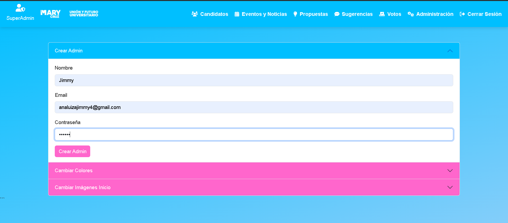

   

### **Personalización del Sistema - Cambio de Colores**
El sistema permite personalizar la apariencia tanto de la vista de usuario como de la vista de administración mediante una herramienta de configuración de colores.

1. **Opciones de Configuración**  
   - **Colores Generales:** Modifican los colores del navbar, el footer y algunos elementos de las páginas en la vista de usuario. También se aplican a la interfaz de administración.
   - **Secciones:** Modifican el color de fondo de estas secciones únicamente en la página de inicio de la vista de usuario.
     - **Sección Candidatos**
     - **Sección Propuestas**
     - **Sección Eventos y Noticias**
   - **Páginas:** Cambian el color de fondo de las páginas completas, tanto en la vista de usuario como en la administración.
     - **Página Candidatos**
     - **Página Eventos y Noticias**
     - **Página Propuestas**
     - **Página Sugerencias**
   - **Página de Login:** Permite modificar el degradado de fondo en la pantalla de inicio de sesión.

2. **Aplicación de los Cambios**  
   - Cada sección cuenta con un selector de color para elegir la tonalidad deseada.
   - Se incluyen botones de **Aceptar** para guardar los cambios y **Restablecer** para volver a los valores predeterminados.
   - Una vez que se selecciona un color y se presiona "Aceptar", la configuración se guarda y se aplica automáticamente en la interfaz.
   - Si el usuario desea revertir los cambios, puede usar el botón "Restablecer" para volver a los colores originales.

   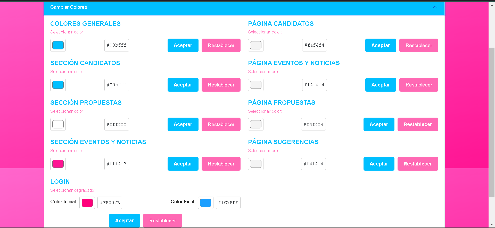

   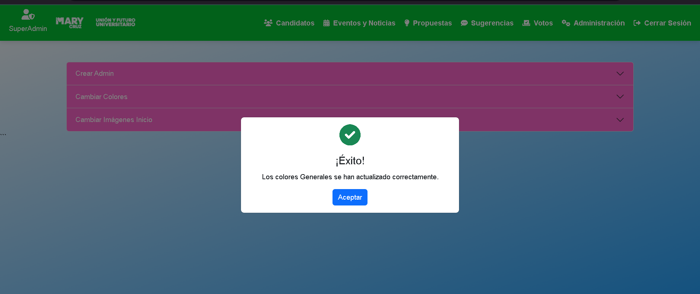

   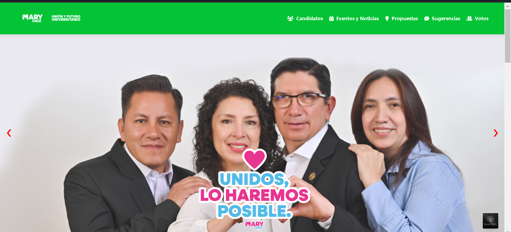


   


  


## Despliegue 📦

_Para desplegar este sistema en un servidor en producción:_

1. Sube los archivos del proyecto al servidor mediante FTP o herramientas de implementación.
2. Configura la base de datos en el entorno de producción.
3. Ajusta las rutas y configuraciones en los archivos PHP según el entorno.


## Autores ✒️

* **Sebastián Ortiz** - *Desarrollo* - [SebastianOrtiz2004](https://github.com/SebastianOrtiz2004/SebastianOrtiz)
* **Diego Jijón** - *Desarrollo y Documentación* - [Diego200509](https://github.com/Diego200509)
* **Elkin López** - *Desarrollo* - [Elkinnn](https://github.com/Elkinnn)
* **Leonel Barros** - *Desarrollo* - [Leo538](https://github.com/Leo538)
* **T1Angel4220** - *Desarrollo* - [T1Angel4220](https://github.com/T1Angel4220)


## Expresiones de Gratitud 🎁

* Comenta a otros sobre este proyecto 📢.
* Invita una cerveza 🍺 o un café ☕ al equipo.
* Da las gracias públicamente 🤓.
* etc.

---
